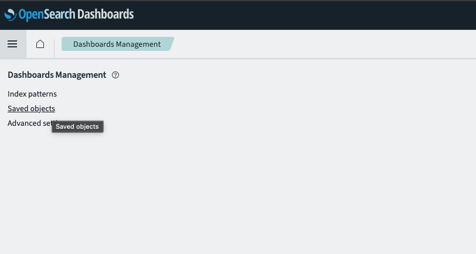
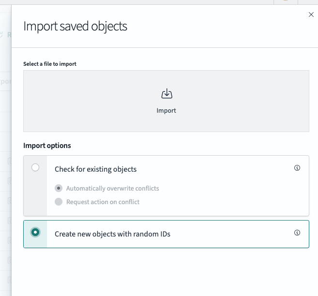

# Getting Started
Getting started with the OTEL demo including running the OpenSearch Server and Dashboard.

`docker-compose up -d` starts all the services and initiates the load-generator activity for synthetically creating user activity on the demo web store.

The following web-pages can be directly access to review the load generator
- http://localhost:8089/

- Here the synthetic testing process can be started

The following web-pages can be directly access to actually simulate store purchase
- http://localhost:8080/ (front-end) OR  http://localhost:90 (nginx-forntend proxy)
- Here the actual shop demo can be used (simulated demo shop ...)

---

## Logging In Dashboard

Once all services are up and running - log-in to the Dashboard and enter the next credentials

**User: `admin`  | Password:  `my_%New%_passW0rd!@#`**

- http://localhost:5601/
- OpenSearch Dashboard login

## Store URLs in session storage
Enable Store URLs in session storage for allowing to view and edit Vega based visualizations
- Once logged in, go to [Advanced Setting](http://localhost:5601/app/management/opensearch-dashboards/settings)
  

## Installing OTEL Services Demo

Install OpenTelemetry Dashboards workflow - navigate to the [Observability Catalog Release Page](https://github.com/opensearch-project/opensearch-catalog/blob/main/docs/integrations/Release.md) sections and select the [Otel Services Dashboards 1.0.0 Release](https://github.com/opensearch-project/opensearch-catalog/releases/tag/otel_services_dashboard-1.0.0)
- Go to the Dashboard Management and select `Saved Objects`
- Select the `Import` Icon and choose the Otel Services Dashboards 1.0.0 Release file
- In the import Dialog: Check for existing objects, Automatically overwrite conflicts and press the import button

This will load all the OpenTelemetry Services flow dashboards and you can immediately navigate to any of the imported dashboards and monitor the ingested telemetry data.
>  _For detailed instructions see [here](https://github.com/opensearch-project/opensearch-catalog/releases/tag/otel_services_dashboard-1.0.0)_

## Ingestion Rate Dashboard
This dashboard show the 3 signals ingestion rate as they are shipped via data-prepper into OpenSearch indices

## Services High Level Dashboards View
This dashboard show the 3 signals ingestion rate as they are shipped via data-prepper into OpenSearch indices

## Single Service Details Dashboards View
This dashboard show the specific service details including associated high level view of the metrics collected for the service

## Service Metrics View

### Service Metrics system projection Dashboards
This dashboard show the specific service details in particular the system related metrics collected for the service

### Service Metrics network projection Dashboards
This dashboard show the specific service details in particular the network related metrics collected for the service

## Trace Analytics
Traces can also be seen using the following [menu-item](http://localhost:5601/app/observability-traces#/traces)

- showing a table of traces with their duration/errors rates

- showing a specific trace's spans water fall chart
---
## Services Analytics
Services can be also be seen using the following [menu-item](http://localhost:5601/app/observability-traces#/services)

- showing the table of services including their Group /Avg Duration / Errors

- showing the service map graph with the services relationships

- showing the services trace-group charts according to Avg Duration / Traces-Error rates / Traces Request rates

---
## Metrics Analytics

### Setting Up Prometheus `datasource`
- First [setup](http://localhost:5601/app/datasources#/new) the Prometheus datasource we wanted to connect with
  

### Query Prometheus OTEL metrics
- [Select the OTEL metrics](http://localhost:5601/app/observability-metrics#/) (Prometheus / OpenSearch) we want to display
  
  

### Query OpenSearch OTEL metrics
- Select the `ss4o_metrics-*-*` based index to view the OTEL metrics stored in OpenSearch:
  
  

## Discover - Log Exploration
- [Discover](http://localhost:5601/app/data-explorer/discover) the OTEL logs stored inside OpenSearch
  
