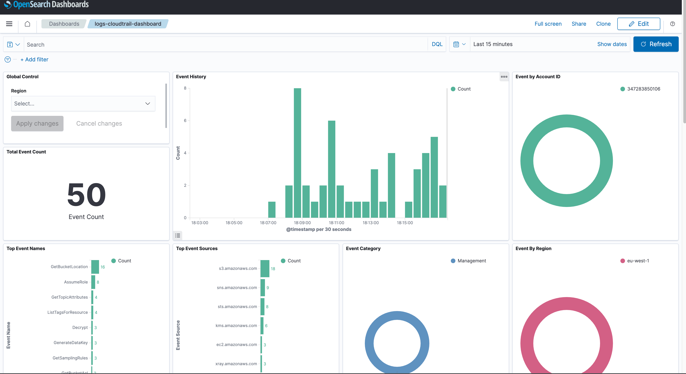

# AWS CloudTrail Log Integration

## What is AWS CloudTrail?

AWS OCSF CloudTrail is a service that enables governance, compliance, operational auditing, and risk auditing of your AWS account. With CloudTrail, you can log, continuously monitor, and retain account activity related to actions across your AWS infrastructure.

CloudTrail provides event history of your AWS account activity, including actions taken through the AWS Management Console, AWS SDKs, command-line tools, and other AWS services.

CloudTrail can be used for a number of tasks, such as:

- Simplifying compliance auditing
- Tracking changes to AWS resources
- Troubleshooting operational issues
- Identifying unwanted actions or unexpected patterns in behavior

CloudTrail's event log data is delivered to an S3 bucket, and does not affect network throughput or latency. You can create or delete CloudTrail logs without any risk of impact to system performance.

See additional details [here](https://docs.aws.amazon.com/awscloudtrail/latest/userguide/what_is_cloud_trail_top_level.html).
See OCSF security [standard and reference](https://github.com/ocsf/examples/tree/main/mappings/markdown/AWS/v1.1.0/CloudTrail) 

## What is OCSF Security schema and standard ?

The Open Cybersecurity Schema Framework (OCSF) is a collaborative, open-source effort by AWS and leading partners in the cybersecurity industry.
OCSF provides a standard schema for common security events, defines versioning criteria to facilitate schema evolution, and includes a self-governance process for security log producers and consumers.
The public source code for [OCSF](https://docs.aws.amazon.com/security-lake/latest/userguide/open-cybersecurity-schema-framework.html) is hosted on [GitHub](https://github.com/ocsf/ocsf-schema).

## What is OCSF AWS CloudTrail Log Integration?

An integration is a set of pre-configured assets which are bundled together in a meaningful manner.

AWS CloudTrail log integration includes dashboards, visualizations, queries, and an index mapping.

### Dashboards

The Dashboard uses the index alias `logs-cloudtrail` for shortening the index name - be advised.

### Release
 - [Cloud Trail OCSF S3 Flint integration release](https://github.com/opensearch-project/opensearch-catalog/releases/tag/amazon_OCSF_cloudtrail-2.0.0)